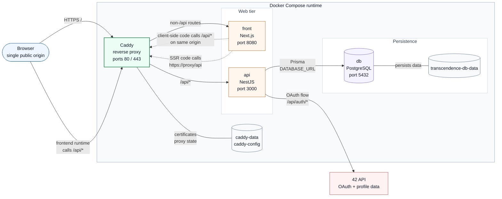
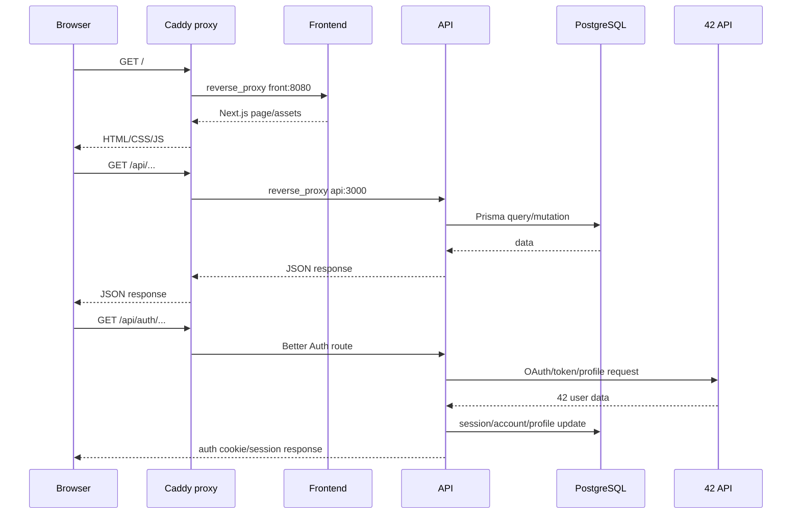
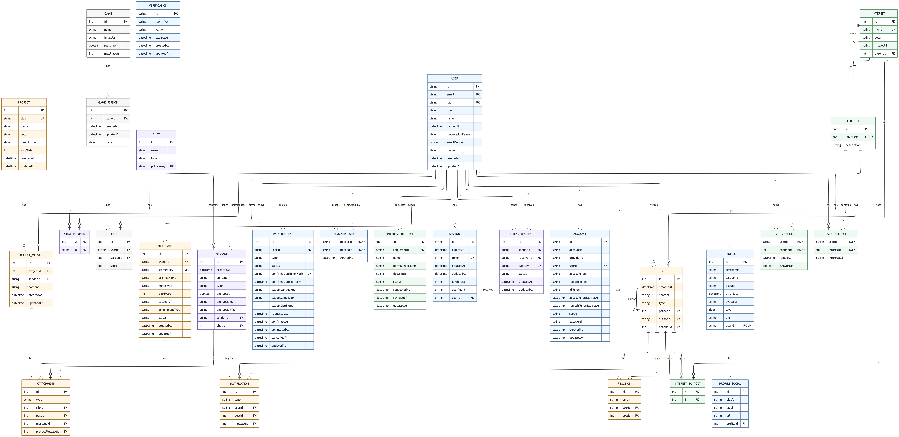

*This project has been created as part of the 42 curriculum by ade-sarr, albestae, bazaluga, ilavillu, licohen.*

# 42Connect

## Description

42Connect is a social web application for 42 students. It lets users authenticate, manage their profile, discover people with shared interests, join interest-based channels, publish posts and exchange messages.

The application is built as a separate frontend/backend/database stack behind an HTTPS reverse proxy.

## Instructions

### Prerequisites

- Docker and Docker Compose
- Make
- Google Chrome, latest stable version

### Environment

Create the local environment file:

```sh
cp docker/.env.example docker/.env
```

Then fill the required secrets in `docker/.env`, especially:

- PostgreSQL credentials
- 42 OAuth credentials
- Better Auth public URL
- Frontend and API public URLs
- SMTP credentials for email features

For the current local HTTPS setup, the public URLs should use:

```env
BETTER_AUTH_URL=https://localhost:2323
NEXT_PUBLIC_API_URL=https://localhost:2323
NEXT_PUBLIC_FRONTEND_URL=https://localhost:2323
NEXT_INTERNAL_API_URL=https://proxy:2323/api
CADDY_INTERNAL_CA_CERT=/caddy-data/caddy/pki/authorities/local/root.crt
```

### Run

Production-like stack:

```sh
make
```

Open:

```text
https://localhost:2323
```

Development stack:

```sh
make dev
```

Useful development URLs:

- Frontend: `https://localhost:2323`
- API: `https://localhost:2323/api`
- HTTPS proxy: `https://localhost:2323`
- Adminer: `http://localhost:8081`
- PostgreSQL host port: `5433`

Useful commands:

```sh
make logs
make down
make dev-logs
make dev-down
make db-setup
make migrate-generate name=<migration_name>
```

## Technical Stack

| Layer | Technologies |
| --- | --- |
| Frontend | Next.js, React, TypeScript, Tailwind CSS, Bun |
| Backend | NestJS, TypeScript, Bun, Better Auth |
| Database | PostgreSQL |
| ORM | Prisma |
| Reverse proxy | Caddy |
| Runtime | Docker Compose |

Main architecture:

- Caddy is the public HTTPS entry point.
- `/api/*` is forwarded to the NestJS API.
- Every other route is forwarded to the Next.js frontend.
- the API is the only service that talks directly to PostgreSQL.

## Frontend Design System

The frontend includes a custom-made design system with shared color tokens,
typography, custom icons, and reusable React components. See
[docs/FRONTEND_DESIGN_SYSTEM.md](docs/FRONTEND_DESIGN_SYSTEM.md) for the
component inventory and design token notes.

<details>
<summary>Architecture details</summary>

### Project Architecture

The project is split into a frontend, an API, a PostgreSQL database, and a Caddy reverse proxy.

In production, the browser should only talk to Caddy. Caddy exposes HTTP/HTTPS, routes frontend pages to the `front` container, and routes every `/api/*` request to the `api` container. The API is the only service that talks directly to PostgreSQL.

#### Runtime Topology



#### Request Flow



#### SSR, SEO, and HTTPS Routing Rule

The project uses Next.js server components for the SSR/SEO module. An SSR route is
implemented as a small server `page.tsx` that loads the first screen of data, then
passes that data to a colocated client component for interactivity.

Example pattern:

```text
frontend/app/(app)/profile/[username]/page.tsx
  server component
  reads route params
  calls lib/server/api.ts
  exports generateMetadata(...)
  renders ProfilePageClient

frontend/app/(app)/profile/[username]/ProfilePageClient.tsx
  client component
  receives initialProfile
  manages state, modals, forms, sockets, and user actions
```

When adding or updating an SSR route, follow these rules:

- keep `page.tsx` as a server component, without `"use client"`;
- move browser-only behavior into a colocated `*Client.tsx` component;
- use `frontend/lib/server/api.ts` for authenticated server-side API calls;
- do not call `https://localhost/api` from SSR code, because inside the `front` container `localhost` means the frontend container itself;
- do not call the API with plain `http://api:3000` from SSR code, because the subject requires HTTPS for backend access;
- use `NEXT_INTERNAL_API_URL=https://proxy:2323/api`, which sends SSR requests through Caddy over HTTPS inside the Docker network;
- keep `NODE_EXTRA_CA_CERTS` mapped from `CADDY_INTERNAL_CA_CERT` for the frontend container so Node trusts Caddy's internal certificate authority.

SEO is implemented with Next metadata APIs:

- `frontend/app/layout.tsx` defines the global title, description, Open Graph,
  and Twitter metadata;
- public pages such as `/login`, `/privacy`, and `/terms` define route metadata;
- dynamic SSR routes such as `/profile/[username]` and `/channels/[slug]` use
  `generateMetadata(...)`;
- authenticated app routes are marked `noindex`;
- `frontend/app/robots.ts` generates `/robots.txt`;
- `frontend/app/sitemap.ts` generates `/sitemap.xml`.

#### Services

| Service | Role | Internal port | Public access |
| --- | --- | --- | --- |
| `proxy` | Caddy reverse proxy, HTTPS entry point, routes traffic | `2323` | yes |
| `front` | Next.js application served by Bun | `8080` | through `proxy` in production |
| `api` | NestJS API, Better Auth, Prisma access | `3000` | through `proxy` at `/api/*` |
| `db` | PostgreSQL database | `5432` | no in production |
| `adminer` | Database UI for development only | `8080` in container, `8081` on host | dev only |

#### Production vs Development

Production uses `docker/compose.yaml`.

- `proxy` exposes ports `2323`.
- `front`, `api`, and `db` are intended to be reached through Docker networking.
- the API entry point waits for PostgreSQL, then runs `prisma migrate deploy`.

Development overlays `docker/compose-dev.yaml`.

- `front` and `api` are not exposed directly on host ports; use the HTTPS proxy.
- `db` is exposed on host port `5433`.
- `adminer` is exposed on host port `8081`.
- source folders are bind-mounted for live development.

</details>

## Database Schema

The database is defined with Prisma in [backend/api/prisma/schema.prisma](backend/api/prisma/schema.prisma).



Main schema areas:

- users, sessions, accounts, profiles, and profile socials
- interests, interest requests, channels, posts, reactions, files, and attachments
- projects, project messages, friend requests, blocked users, chats, messages, and notifications
- privacy data requests and export metadata
- games, game sessions, and players

Additional schema documentation (class diagram):

- [Mermaid schema](docs/class_diagram_db.png)
- [Mermaid source](docs/schema_db_mermaid.md)

## Features List

| Feature | Description | Owner(s) |
| --- | --- | --- |
| Authentication | Email/password authentication and 42 OAuth login through Better Auth. | ilavillu |
| Password recovery | Forgot-password and reset-password flow backed by the email service. | ilavillu, bazaluga |
| Profiles | User profile display and editing, including avatar/profile metadata. | albestae, bazaluga, ilavillu |
| Interests | Interest catalog, user-interest selection, and user-submitted interest requests. | bazaluga |
| Suggestions | User suggestions based on shared interests. | licohen, bazaluga |
| Channels | Interest-based channels with posts, replies, reactions, and attachments. | bazaluga, albestae |
| Friends | Friendship management. | licohen, bazaluga |
| User blocking | Block/unblock users and hide blocked users from social surfaces. | bazaluga, ade-sarr |
| Messages | Chat, persisted message history, unread badges, and encrypted private message storage. | ade-sarr, albestae, bazaluga |
| Projects | Project spaces with project discussions and administrator project management. | albestae, bazaluga |
| Admin and moderation | Administrator panel for users, roles, bans, channel/project management, member removal, and content deletion. | licohen, bazaluga, albestae |
| Files | Upload and attachment management for supported file types. | bazaluga, ade-sarr |
| Privacy | Privacy policy, terms page, confirmed data export flow, export download, and account deletion request flow. | albestae, bazaluga |

## Modules

| Module | Type | Points | Implementation notes | Owner(s) |
| --- | --- | --- | --- | --- |
| Frontend and backend frameworks | Major | 2 | Next.js frontend and NestJS backend. | albestae, bazaluga |
| Real-time features using WebSockets | Major | 2 | WebSocket-oriented chat and instant notification work. | ade-sarr |
| ORM | Minor | 1 | Prisma models, migrations, and typed database client. | ilavillu, ade-sarr, bazaluga, licohen |
| User interaction | Major | 2 | Profiles, friends, channels, posts, and messaging foundations. | albestae, bazaluga, ade-sarr |
| Standard user management | Major | 2 | Authentication, profile management, avatar/profile fields. | ilavillu, bazaluga, albestae |
| OAuth authentication | Minor | 1 | 42 OAuth through Better Auth. | bazaluga, ilavillu |
| Advanced permissions system | Major | 2 | Role-based admin access, admin routes, user/channel management, validation, and cascade user deletion. | licohen |
| Organization system | Major | 2 | Interests/channels act as organizations: admins can create/delete channels, add/remove users, and members can read, create, and update posts inside channel spaces. | bazaluga, licohen |
| File upload and management | Minor | 1 | File assets and attachments with backend validation/storage logic. | bazaluga |
| GDPR compliance features | Minor | 1 | Data export/deletion requests with email confirmation, export generation, download, and account deletion flow. | bazaluga, albestae |
| Server-side rendering and SEO | Minor | 1 | Next.js server components fetch initial data for selected routes, route metadata improves SEO, and robots/sitemap are generated. | albestae, bazaluga |
| Custom-made design system | Minor | 1 | Shared color tokens, typography, custom icons, and more than 10 reusable React components documented in `docs/FRONTEND_DESIGN_SYSTEM.md`. | albestae |
| Private message encryption | Minor custom | 1 | Private chat message bodies are encrypted before storage with authenticated encryption, per-message IV/tag metadata, and `MESSAGE_ENCRYPTION_KEY` configuration. | ade-sarr, bazaluga |
| **Total** |  | **19** |  |  |

## Team Information

| Member | Role(s) | Responsibilities |
| --- | --- | --- |
| ade-sarr | Developer | Chat, WebSocket notifications, message encryption, file/message integration, and Prisma schema support. |
| albestae | Product Owner, Developer | Product idea, mockups, frontend structure, design system, SSR/SEO pages, and user-facing flows. |
| bazaluga | Technical Lead, Developer | Architecture, Docker/Makefile, Bun migration, HTTPS proxy, 42 OAuth integration, files, GDPR, and documentation. |
| ilavillu | Product Manager, Developer | Better Auth registration/login, password recovery, profile/auth integration, and backend setup support. |
| licohen | Developer | Jaccard suggestions, advanced permissions, admin routes, organization management, and cascade deletion. |

## Project Management

To complete before evaluation:

- role distribution
- task tracking tool
- meeting rhythm
- communication channel
- code review process

## Individual Contributions

| Member | Contributions |
| --- | --- |
| ade-sarr | Worked on the chat prototype, WebSocket-oriented structure, instant message notifications, private message encryption support, file/message integration, early Prisma schema iterations, channel membership fields such as favorites, and Docker/Makefile integration fixes. |
| albestae | Designed and implemented much of the frontend foundation: application layout, reusable UI structure, custom design system, themes, login/register/guest/forgot-password pages, privacy and terms pages, channel/profile/message/project/admin views, frontend data clients, SSR/SEO page splits, responsive fixes, and invitation flow improvements. |
| bazaluga | Set up and maintained most of the project infrastructure: Docker Compose, Makefile targets, Bun migration, development workflow, database documentation, Caddy HTTPS reverse proxy, production fixes, 42 OAuth/profile level synchronization, interests/channels, friendships, suggestions integration, file uploads, GDPR export/deletion flow, password reset, private-message encryption integration, admin/project/channel management support, and architecture documentation. |
| ilavillu | Worked on Better Auth registration and login flows, password recovery, profile/auth integration, early database and backend setup support, Prisma setup/version fixes, port corrections, and permissions/group fixes during integration. |
| licohen | Implemented the Jaccard recommendation algorithm and its NestJS/Prisma integration, aligned suggestion responses with frontend needs, added seed/test support, cleaned the Jaccard module and documentation, and implemented advanced permissions with admin routes, validation, organization/channel management support, and cascade user deletion. |

## Resources

- [Next.js documentation](https://nextjs.org/docs)
- [NestJS documentation](https://docs.nestjs.com/)
- [Prisma documentation](https://www.prisma.io/docs)
- [Caddy documentation](https://caddyserver.com/docs/)
- [Better Auth documentation](https://www.better-auth.com/docs)
- [Mermaid documentation](https://mermaid.js.org/)
- [42 API documentation](https://api.intra.42.fr/apidoc)

AI was used to generate a seed for the database, check code and diagrams for errors, and clean this README.
