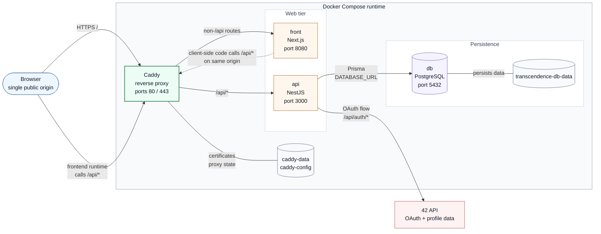
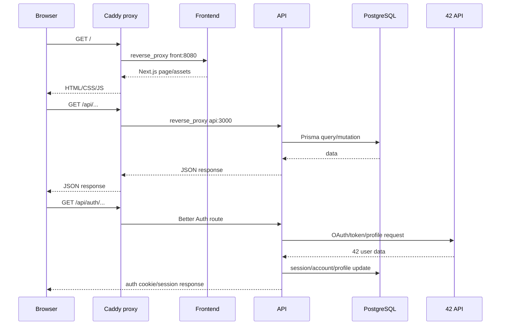

# Project Architecture

The project is split into a frontend, an API, a PostgreSQL database, and a Caddy reverse proxy.

In production, the browser should only talk to Caddy. Caddy exposes HTTP/HTTPS, routes frontend pages to the `front` container, and routes every `/api/*` request to the `api` container. The API is the only service that talks directly to PostgreSQL.

## Runtime Topology

## Request Flow

## Services

| Service | Role | Internal port | Public access |
| --- | --- | --- | --- |
| `proxy` | Caddy reverse proxy, HTTPS entrypoint, routes traffic | `80`, `443` | yes |
| `front` | Next.js application served by Bun | `8080` | through `proxy` in production |
| `api` | NestJS API, Better Auth, Prisma access | `3000` | through `proxy` at `/api/*` |
| `db` | PostgreSQL database | `5432` | no in production |
| `adminer` | Database UI for development only | `8080` in container, `8081` on host | dev only |

## Production vs Development

Production uses `docker/compose.yaml`.

- `proxy` exposes ports `80` and `443`.
- `front`, `api`, and `db` are intended to be reached through Docker networking.
- the API entrypoint waits for PostgreSQL, then runs `prisma migrate deploy`.

Development overlays `docker/compose-dev.yaml`.

- `front` is also exposed on host port `8080`.
- `api` is also exposed on host port `3000`.
- `db` is exposed on host port `5433`.
- `adminer` is exposed on host port `8081`.
- source folders are bind-mounted for live development.