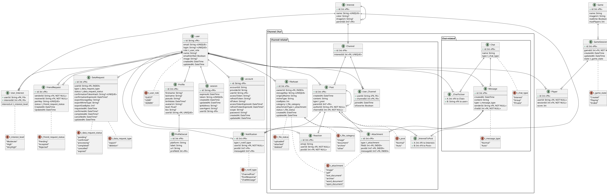

/Database schemes/

* Class diagram (conceptual)
#+name: class_diagram
#+begin_src plantuml :file db.png
@startuml

class User
{
    + id: String
    + email: String
    + login: String?
    + role: UserRole
    + name: String?
    + emailVerified: Boolean
    + image: String?
    + createdAt: DateTime
    + updatedAt: DateTime
}

class Profile
{
    + firstname: String?
    + lastname: String?
    + pseudo: String?
    + birthdate: DateTime?
    + avatarUri: String?
    + level: Float?
    + bio: String?
}

class ProfileSocial
{
    + platform: String
    + label: String
    + url: String
}

class Session
{
    + token: String
    + expiresAt: DateTime
    + ipAddress: String?
    + userAgent: String?
}

class Account
{
    + accountId: String
    + providerId: String
    + accessToken: String?
    + refreshToken: String?
    + idToken: String?
    + scope: String?
    + password: String?
}

class Verification
{
    + identifier: String
    + value: String
    + expiresAt: DateTime
}

class Interest
{
    + name: String
    + color: String?
    + imageUri: String?
}

class UserInterest
{
    + interestLvl: InterestLevel
}

class Channel
{
    + interestId: Int
}

class UserChannel
{
    + joinedAt: DateTime
    + isFavorite: Boolean
}

class Post
{
    + createdAt: DateTime
    + content: String
    + type: PostType
}

class Reaction
{
    + emoji: String
}

class FileAsset
{
    + storageKey: String
    + originalName: String
    + mimeType: String
    + sizeBytes: Int
    + category: FileCategory
    + attachmentType: AttachmentType
    + status: FileStatus
}

class Attachment
{
    + type: AttachmentType
}

class FriendRequest
{
    + pairKey: String
    + status: FriendRequestStatus
    + CreatedAt: DateTime
    + UpdatedAt: DateTime
}

class Chat
{
    + name: String
    + type: ChatType
}

class Message
{
    + createdAt: DateTime
    + content: String
    + type: MessageType
}

class Notification
{
    + type: NotifType
}

class DataRequest
{
    + type: DataRequestType
    + status: DataRequestStatus
    + confirmationTokenHash: String?
    + confirmationExpiresAt: DateTime?
    + exportStorageKey: String?
    + exportMimeType: String?
    + exportSizeBytes: Int?
    + requestedAt: DateTime
    + confirmedAt: DateTime?
    + completedAt: DateTime?
    + cancelledAt: DateTime?
}

class Game
{
    + name: String
    + imageUri: String
    + realtime: Boolean
    + maxPlayers: Int
}

class GameSession
{
    + createdAt: DateTime
    + updatedAt: DateTime
    + state: GameState
}

class Player
{
    + score: Int
}

enum UserRole
{
    GUEST
    USER
    ADMIN
}

enum FriendRequestStatus
{
    Pending
    Accepted
    Rejected
}

enum InterestLevel
{
    Moderate
    High
    VeryHigh
}

enum AttachmentType
{
    image
    pdf
    text_document
    archive
    word_document
    open_document
}

enum FileCategory
{
    image
    document
    archive
    other
}

enum FileStatus
{
    uploaded
    attached
    deleted
}

enum DataRequestType
{
    export
    deletion
}

enum DataRequestStatus
{
    pending
    confirmed
    processing
    completed
    cancelled
    expired
}

enum ChatType
{
    Interest
    Group
    Private
}

enum MessageType
{
    Normal
    Auto
}

enum PostType
{
    Normal
    Auto
}

enum GameState
{
    Created
    Playing
    Ended
}

enum NotifType
{
    ChannelPost
    PostResponse
    ChatMessage
}

UserRole .. User
FriendRequestStatus .. FriendRequest
InterestLevel .. UserInterest
AttachmentType .. FileAsset
AttachmentType .. Attachment
FileCategory .. FileAsset
FileStatus .. FileAsset
DataRequestType .. DataRequest
DataRequestStatus .. DataRequest
ChatType .. Chat
MessageType .. Message
PostType .. Post
GameState .. GameSession
NotifType .. Notification

User "1" -- "0..1" Profile : Has >
Profile "1" -- "*" ProfileSocial : Has >
User "1" -- "*" Session : Has >
User "1" -- "*" Account : Has >

User "*" -- "*" Interest : Has >
(User, Interest) .. UserInterest
Interest "0..1" -- "*" Interest : Has child(ren) >
Interest "1" -- "0..1" Channel : < Is linked
User "*" -- "*" Channel : Is member >
(User, Channel) .. UserChannel

User "1" -- "*" Post : Writes >
Channel "1" -- "*" Post : Contains >
Post "0..1" -- "*" Post : < Replies
Post "*" -- "*" Interest : Is tagged with >
Post "1" -- "*" Reaction : Receives >
User "1" -- "*" Reaction : Adds >

User "1" -- "*" FileAsset : Owns >
FileAsset "1" -- "*" Attachment : Provides file >
Post "0..1" -- "*" Attachment : Contains >
Message "0..1" -- "*" Attachment : Contains >

User "1" -- "*" FriendRequest : Sends >
User "1" -- "*" FriendRequest : Receives >
User "*" -- "*" Chat : Participates >
Chat "1" -- "*" Message : Contains >
User "1" -- "*" Message : Writes >
User "1" -- "*" Notification : Receives >
Post "0..1" -- "*" Notification : Triggers >
Message "0..1" -- "*" Notification : Triggers >
User "1" -- "*" DataRequest : Requests >

Game "1" -- "*" GameSession : Has >
GameSession "1" -- "*" Player : Has >
User "1" -- "*" Player : Plays >
@enduml
#+end_src

#+RESULTS: class_diagram
[[file:db.png]]

* Entity-Relationship diagram

#+name: er_diagram
#+begin_src plantuml :file er_db.png
@startuml
skinparam packageStyle folder

enum t_user_role
{
    "GUEST"
    "USER"
    "ADMIN"
}

entity "user" as user
{
    + id: String <<PK>>
    --
    email: String <<UNIQUE>>
    login: String? <<UNIQUE>>
    role: t_user_role
    name: String?
    emailVerified: Boolean
    image: String?
    createdAt: DateTime
    updatedAt: DateTime
}

user .. t_user_role

entity "Profile" as profile
{
    + id: Int <<PK>>
    --
    firstname: String?
    lastname: String?
    pseudo: String?
    birthdate: DateTime?
    avatarUri: String?
    level: Float?
    bio: String?
    userId: String <<FK, UNIQUE>>
}

entity "ProfileSocial" as profile_social
{
    + id: Int <<PK>>
    --
    platform: String
    label: String
    url: String
    profileId: Int <<FK>>
}

entity "session" as session
{
    + id: String <<PK>>
    --
    expiresAt: DateTime
    token: String <<UNIQUE>>
    createdAt: DateTime
    updatedAt: DateTime
    ipAddress: String?
    userAgent: String?
    userId: String <<FK>>
}

entity "account" as account
{
    + id: String <<PK>>
    --
    accountId: String
    providerId: String
    userId: String <<FK>>
    accessToken: String?
    refreshToken: String?
    idToken: String?
    accessTokenExpiresAt: DateTime?
    refreshTokenExpiresAt: DateTime?
    scope: String?
    password: String?
    createdAt: DateTime
    updatedAt: DateTime
}

entity "verification" as verification
{
    + id: String <<PK>>
    --
    identifier: String
    value: String
    expiresAt: DateTime
    createdAt: DateTime
    updatedAt: DateTime
}

entity "Interest" as interest
{
    + id: Int <<PK>>
    --
    name: String <<UNIQUE>>
    color: String?
    imageUri: String?
    parentId: Int? <<FK>>
}

enum t_interest_level
{
    "Moderate"
    "High"
    "VeryHigh"
}

entity "User_Interest" as user_interest
{
    + userId: String <<PK, FK>>
    + interestId: Int <<PK, FK>>
    --
    interestLvl: t_interest_level
}

user_interest .. t_interest_level

package Channel_Chat.Channel-related
{
    enum t_post
    {
        "Normal"
        "Auto"
    }

    entity "Post" as post
    {
        + id: Int <<PK>>
        --
        createdAt: DateTime
        content: String
        type: t_post
        parentId: Int? <<FK>>
        authorId: String <<FK, NOT NULL>>
        channelId: Int <<FK, NOT NULL>>
    }

    post .. t_post

    enum t_attachment
    {
        "image"
        "pdf"
        "text_document"
        "archive"
        "word_document"
        "open_document"
    }

    enum t_file_category
    {
        "image"
        "document"
        "archive"
        "other"
    }

    enum t_file_status
    {
        "uploaded"
        "attached"
        "deleted"
    }

    entity "FileAsset" as file_asset
    {
        + id: Int <<PK>>
        --
        ownerId: String <<FK, INDEX>>
        storageKey: String <<UNIQUE>>
        originalName: String
        mimeType: String
        sizeBytes: Int
        category: t_file_category
        attachmentType: t_attachment
        status: t_file_status
        createdAt: DateTime
        updatedAt: DateTime
    }

    file_asset .. t_attachment
    file_asset .. t_file_category
    file_asset .. t_file_status

    entity "Attachment" as attachment
    {
        + id: Int <<PK>>
        --
        type: t_attachment
        fileId: Int <<FK, INDEX>>
        postId: Int? <<FK, INDEX>>
        messageId: Int? <<FK, INDEX>>
    }

    attachment .. t_attachment

    entity "Reaction" as reaction
    {
        + id: Int <<PK>>
        --
        emoji: String
        userId: String <<FK, NOT NULL>>
        postId: Int <<FK, NOT NULL>>
    }

    entity "Channel" as channel
    {
        + id: Int <<PK>>
        --
        interestId: Int <<FK, UNIQUE>>
    }

    entity "User_Channel" as channel_user
    {
        + userId: String <<PK, FK>>
        + channelId: Int <<PK, FK>>
        --
        joinedAt: DateTime
        isFavorite: Boolean
    }

    entity "_InterestToPost" as tag_post
    {
        + A: Int <<FK to Interest>>
        + B: Int <<FK to Post>>
        --
    }
}

enum t_friend_request_status
{
    "Pending"
    "Accepted"
    "Rejected"
}

entity "FriendRequest" as friend_request
{
    + id: Int <<PK>>
    --
    senderId: String <<FK, NOT NULL>>
    receiverId: String <<FK, NOT NULL>>
    pairKey: String <<UNIQUE>>
    status: t_friend_request_status
    CreatedAt: DateTime
    UpdatedAt: DateTime
}

friend_request .. t_friend_request_status

package Channel_Chat.Chat-related
{
    enum t_chat_type
    {
        "Interest"
        "Group"
        "Private"
    }

    entity "Chat" as chat
    {
        + id: Int <<PK>>
        --
        name: String
        type: t_chat_type
    }

    chat .. t_chat_type

    entity "_ChatToUser" as user_chat
    {
        + A: Int <<FK to Chat>>
        + B: String <<FK to user>>
    }

    enum t_message_type
    {
        "Normal"
        "Auto"
    }

    entity "Message" as message
    {
        + id: Int <<PK>>
        --
        createdAt: DateTime
        content: String
        type: t_message_type
        senderId: String <<FK, NOT NULL>>
        chatId: Int <<FK, NOT NULL>>
    }

    message .. t_message_type
}

enum t_notif_type
{
    "ChannelPost"
    "PostResponse"
    "ChatMessage"
}

entity "Notification" as notification
{
    + id: Int <<PK>>
    --
    type: t_notif_type
    userId: String <<FK, NOT NULL>>
    postId: Int? <<FK>>
    messageId: Int? <<FK>>
}

notification .. t_notif_type

enum t_data_request_type
{
    "export"
    "deletion"
}

enum t_data_request_status
{
    "pending"
    "confirmed"
    "processing"
    "completed"
    "cancelled"
    "expired"
}

entity "DataRequest" as data_request
{
    + id: Int <<PK>>
    --
    userId: String <<FK, INDEX>>
    type: t_data_request_type
    status: t_data_request_status
    confirmationTokenHash: String? <<UNIQUE>>
    confirmationExpiresAt: DateTime?
    exportStorageKey: String?
    exportMimeType: String?
    exportSizeBytes: Int?
    requestedAt: DateTime
    confirmedAt: DateTime?
    completedAt: DateTime?
    cancelledAt: DateTime?
    updatedAt: DateTime
}

data_request .. t_data_request_type
data_request .. t_data_request_status

enum t_game_state
{
    "Created"
    "Playing"
    "Ended"
}

entity "Game" as game
{
    + id: Int <<PK>>
    --
    name: String
    imageUri: String
    realtime: Boolean
    maxPlayers: Int
}

entity "GameSession" as game_session
{
    + id: Int <<PK>>
    --
    gameId: Int <<FK, NOT NULL>>
    createdAt: DateTime
    updatedAt: DateTime
    state: t_game_state
}

game_session .. t_game_state

entity "Player" as player
{
    + id: Int <<PK>>
    --
    userId: String <<FK, NOT NULL>>
    sessionId: Int <<FK, NOT NULL>>
    score: Int
}

user ||--o| profile
profile ||--o{ profile_social
user ||--o{ session
user ||--o{ account

user ||--o{ user_interest
interest ||--o{ user_interest
interest ||--o{ interest

interest ||--o| channel
interest ||--o{ tag_post

channel ||--o{ channel_user
user ||--o{ channel_user

post ||--o{ post
user ||--o{ post
channel ||--o{ post
post ||--o{ attachment
message ||--o{ attachment
file_asset ||--o{ attachment
user ||--o{ file_asset
post ||--o{ tag_post

post ||--o{ reaction
user ||--o{ reaction

user ||--o{ friend_request
user ||--o{ friend_request

user ||--o{ user_chat
chat ||--o{ user_chat

user ||--o{ message
chat ||--o{ message

user ||--o{ notification
post ||--o{ notification
message ||--o{ notification

user ||--o{ data_request

game ||--o{ game_session
game_session ||--o{ player
user ||--o{ player
@enduml
#+end_src

#+RESULTS: er_diagram

