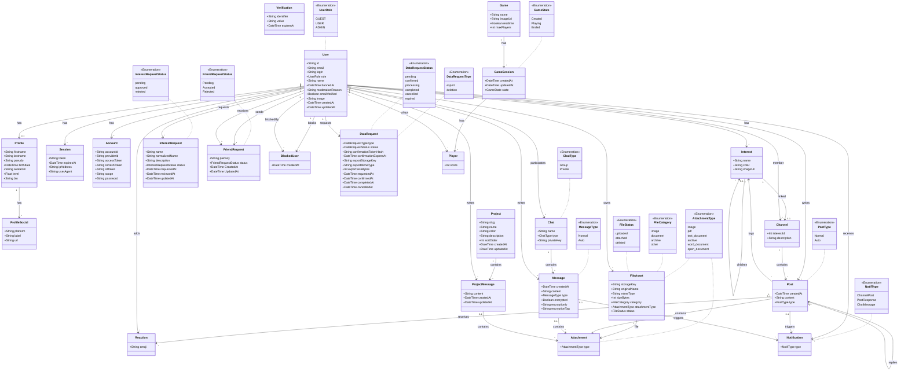
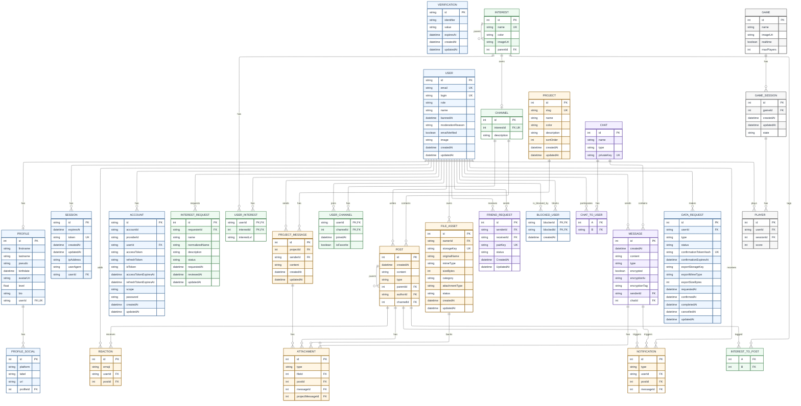

# Database Schemes

## Class Diagram

```mermaid
classDiagram
  class User {
    +String id
    +String email
    +String login
    +UserRole role
    +String name
    +DateTime bannedAt
    +String moderationReason
    +Boolean emailVerified
    +String image
    +DateTime createdAt
    +DateTime updatedAt
  }

  class Profile {
    +String firstname
    +String lastname
    +String pseudo
    +DateTime birthdate
    +String avatarUri
    +Float level
    +String bio
  }

  class ProfileSocial {
    +String platform
    +String label
    +String url
  }

  class Session {
    +String token
    +DateTime expiresAt
    +String ipAddress
    +String userAgent
  }

  class Account {
    +String accountId
    +String providerId
    +String accessToken
    +String refreshToken
    +String idToken
    +String scope
    +String password
  }

  class Verification {
    +String identifier
    +String value
    +DateTime expiresAt
  }

  class Interest {
    +String name
    +String color
    +String imageUri
  }

  class InterestRequest {
    +String name
    +String normalizedName
    +String description
    +InterestRequestStatus status
    +DateTime requestedAt
    +DateTime reviewedAt
    +DateTime updatedAt
  }

  class Channel {
    +Int interestId
    +String description
  }

  class Project {
    +String slug
    +String name
    +String color
    +String description
    +Int sortOrder
    +DateTime createdAt
    +DateTime updatedAt
  }

  class ProjectMessage {
    +String content
    +DateTime createdAt
    +DateTime updatedAt
  }

  class Post {
    +DateTime createdAt
    +String content
    +PostType type
  }

  class Reaction {
    +String emoji
  }

  class FileAsset {
    +String storageKey
    +String originalName
    +String mimeType
    +Int sizeBytes
    +FileCategory category
    +AttachmentType attachmentType
    +FileStatus status
  }

  class Attachment {
    +AttachmentType type
  }

  class FriendRequest {
    +String pairKey
    +FriendRequestStatus status
    +DateTime CreatedAt
    +DateTime UpdatedAt
  }

  class BlockedUser {
    +DateTime createdAt
  }

  class Chat {
    +String name
    +ChatType type
    +String privateKey
  }

  class Message {
    +DateTime createdAt
    +String content
    +MessageType type
    +Boolean encrypted
    +String encryptionIv
    +String encryptionTag
  }

  class Notification {
    +NotifType type
  }

  class DataRequest {
    +DataRequestType type
    +DataRequestStatus status
    +String confirmationTokenHash
    +DateTime confirmationExpiresAt
    +String exportStorageKey
    +String exportMimeType
    +Int exportSizeBytes
    +DateTime requestedAt
    +DateTime confirmedAt
    +DateTime completedAt
    +DateTime cancelledAt
  }

  class Game {
    +String name
    +String imageUri
    +Boolean realtime
    +Int maxPlayers
  }

  class GameSession {
    +DateTime createdAt
    +DateTime updatedAt
    +GameState state
  }

  class Player {
    +Int score
  }

  class UserRole {
    <<Enumeration>>
    GUEST
    USER
    ADMIN
  }

  class FriendRequestStatus {
    <<Enumeration>>
    Pending
    Accepted
    Rejected
  }

  class AttachmentType {
    <<Enumeration>>
    image
    pdf
    text_document
    archive
    word_document
    open_document
  }

  class FileCategory {
    <<Enumeration>>
    image
    document
    archive
    other
  }

  class FileStatus {
    <<Enumeration>>
    uploaded
    attached
    deleted
  }

  class DataRequestType {
    <<Enumeration>>
    export
    deletion
  }

  class DataRequestStatus {
    <<Enumeration>>
    pending
    confirmed
    processing
    completed
    cancelled
    expired
  }

  class InterestRequestStatus {
    <<Enumeration>>
    pending
    approved
    rejected
  }

  class ChatType {
    <<Enumeration>>
    Group
    Private
  }

  class MessageType {
    <<Enumeration>>
    Normal
    Auto
  }

  class PostType {
    <<Enumeration>>
    Normal
    Auto
  }

  class GameState {
    <<Enumeration>>
    Created
    Playing
    Ended
  }

  class NotifType {
    <<Enumeration>>
    ChannelPost
    PostResponse
    ChatMessage
  }

  UserRole .. User
  FriendRequestStatus .. FriendRequest
  AttachmentType .. FileAsset
  AttachmentType .. Attachment
  FileCategory .. FileAsset
  FileStatus .. FileAsset
  DataRequestType .. DataRequest
  DataRequestStatus .. DataRequest
  InterestRequestStatus .. InterestRequest
  ChatType .. Chat
  MessageType .. Message
  PostType .. Post
  GameState .. GameSession
  NotifType .. Notification

  User "1" --> "0..1" Profile : has
  Profile "1" --> "*" ProfileSocial : has
  User "1" --> "*" Session : has
  User "1" --> "*" Account : has

  User "*" --> "*" Interest : has
  User "1" --> "*" InterestRequest : requests
  Interest "0..1" --> "*" Interest : children
  Interest "1" --> "0..1" Channel : linked
  User "*" --> "*" Channel : member

  User "1" --> "*" Post : writes
  Channel "1" --> "*" Post : contains
  Post "0..1" --> "*" Post : replies
  Post "*" --> "*" Interest : tags
  Post "1" --> "*" Reaction : receives
  User "1" --> "*" Reaction : adds

  User "1" --> "*" FileAsset : owns
  FileAsset "1" --> "*" Attachment : file
  Post "0..1" --> "*" Attachment : contains
  Message "0..1" --> "*" Attachment : contains
  ProjectMessage "0..1" --> "*" Attachment : contains

  User "1" --> "*" FriendRequest : sends
  User "1" --> "*" FriendRequest : receives
  User "1" --> "*" BlockedUser : blocks
  User "1" --> "*" BlockedUser : blockedBy
  User "*" --> "*" Chat : participates
  Chat "1" --> "*" Message : contains
  User "1" --> "*" Message : writes
  Project "1" --> "*" ProjectMessage : contains
  User "1" --> "*" ProjectMessage : writes
  User "1" --> "*" Notification : receives
  Post "0..1" --> "*" Notification : triggers
  Message "0..1" --> "*" Notification : triggers
  User "1" --> "*" DataRequest : requests

  Game "1" --> "*" GameSession : has
  GameSession "1" --> "*" Player : has
  User "1" --> "*" Player : plays
```

## Entity-Relationship Diagram

```mermaid
---
config:
  layout: elk
---
erDiagram

  USER {
    string id PK
    string email UK
    string login UK
    string role
    string name
    datetime bannedAt
    string moderationReason
    boolean emailVerified
    string image
    datetime createdAt
    datetime updatedAt
  }

  PROFILE {
    int id PK
    string firstname
    string lastname
    string pseudo
    datetime birthdate
    string avatarUri
    float level
    string bio
    string userId FK, UK
  }

  PROFILE_SOCIAL {
    int id PK
    string platform
    string label
    string url
    int profileId FK
  }

  SESSION {
    string id PK
    datetime expiresAt
    string token UK
    datetime createdAt
    datetime updatedAt
    string ipAddress
    string userAgent
    string userId FK
  }

  ACCOUNT {
    string id PK
    string accountId
    string providerId
    string userId FK
    string accessToken
    string refreshToken
    string idToken
    datetime accessTokenExpiresAt
    datetime refreshTokenExpiresAt
    string scope
    string password
    datetime createdAt
    datetime updatedAt
  }

  VERIFICATION {
    string id PK
    string identifier
    string value
    datetime expiresAt
    datetime createdAt
    datetime updatedAt
  }

  INTEREST {
    int id PK
    string name UK
    string color
    string imageUri
    int parentId FK
  }

  INTEREST_REQUEST {
    int id PK
    string requesterId FK
    string name
    string normalizedName
    string description
    string status
    datetime requestedAt
    datetime reviewedAt
    datetime updatedAt
  }

  USER_INTEREST {
    string userId PK, FK
    int interestId PK, FK
    string interestLvl
  }

  CHANNEL {
    int id PK
    int interestId FK, UK
    string description
  }

  PROJECT {
    int id PK
    string slug UK
    string name
    string color
    string description
    int sortOrder
    datetime createdAt
    datetime updatedAt
  }

  PROJECT_MESSAGE {
    int id PK
    int projectId FK
    string senderId FK
    string content
    datetime createdAt
    datetime updatedAt
  }

  USER_CHANNEL {
    string userId PK, FK
    int channelId PK, FK
    datetime joinedAt
    boolean isFavorite
  }

  POST {
    int id PK
    datetime createdAt
    string content
    string type
    int parentId FK
    string authorId FK
    int channelId FK
  }

  REACTION {
    int id PK
    string emoji
    string userId FK
    int postId FK
  }

  FILE_ASSET {
    int id PK
    string ownerId FK
    string storageKey UK
    string originalName
    string mimeType
    int sizeBytes
    string category
    string attachmentType
    string status
    datetime createdAt
    datetime updatedAt
  }

  ATTACHMENT {
    int id PK
    string type
    int fileId FK
    int postId FK
    int messageId FK
    int projectMessageId FK
  }

  FRIEND_REQUEST {
    int id PK
    string senderId FK
    string receiverId FK
    string pairKey UK
    string status
    datetime CreatedAt
    datetime UpdatedAt
  }

  BLOCKED_USER {
    string blockerId PK, FK
    string blockedId PK, FK
    datetime createdAt
  }

  CHAT {
    int id PK
    string name
    string type
    string privateKey UK
  }

  CHAT_TO_USER {
    int A FK
    string B FK
  }

  MESSAGE {
    int id PK
    datetime createdAt
    string content
    string type
    boolean encrypted
    string encryptionIv
    string encryptionTag
    string senderId FK
    int chatId FK
  }

  NOTIFICATION {
    int id PK
    string type
    string userId FK
    int postId FK
    int messageId FK
  }

  INTEREST_TO_POST {
    int A FK
    int B FK
  }

  DATA_REQUEST {
    int id PK
    string userId FK
    string type
    string status
    string confirmationTokenHash UK
    datetime confirmationExpiresAt
    string exportStorageKey
    string exportMimeType
    int exportSizeBytes
    datetime requestedAt
    datetime confirmedAt
    datetime completedAt
    datetime cancelledAt
    datetime updatedAt
  }

  GAME {
    int id PK
    string name
    string imageUri
    boolean realtime
    int maxPlayers
  }

  GAME_SESSION {
    int id PK
    int gameId FK
    datetime createdAt
    datetime updatedAt
    string state
  }

  PLAYER {
    int id PK
    string userId FK
    int sessionId FK
    int score
  }

  USER ||--o| PROFILE : has
  PROFILE ||--o{ PROFILE_SOCIAL : has
  USER ||--o{ SESSION : has
  USER ||--o{ ACCOUNT : has

  USER ||--o{ USER_INTEREST : has
  INTEREST ||--o{ USER_INTEREST : has
  USER ||--o{ INTEREST_REQUEST : requests
  INTEREST ||--o{ INTEREST : parent
  INTEREST ||--o| CHANNEL : owns
  USER ||--o{ USER_CHANNEL : joins
  CHANNEL ||--o{ USER_CHANNEL : has

  USER ||--o{ POST : writes
  CHANNEL ||--o{ POST : contains
  POST ||--o{ POST : parent
  POST ||--o{ REACTION : receives
  USER ||--o{ REACTION : adds
  POST ||--o{ ATTACHMENT : has
  MESSAGE ||--o{ ATTACHMENT : has
  PROJECT_MESSAGE ||--o{ ATTACHMENT : has
  FILE_ASSET ||--o{ ATTACHMENT : backs
  USER ||--o{ FILE_ASSET : owns
  INTEREST ||--o{ INTEREST_TO_POST : tags
  POST ||--o{ INTEREST_TO_POST : tagged

  USER ||--o{ FRIEND_REQUEST : sends
  USER ||--o{ FRIEND_REQUEST : receives
  USER ||--o{ BLOCKED_USER : blocks
  USER ||--o{ BLOCKED_USER : is_blocked_by

  USER ||--o{ CHAT_TO_USER : participates
  CHAT ||--o{ CHAT_TO_USER : has
  USER ||--o{ MESSAGE : sends
  CHAT ||--o{ MESSAGE : contains
  PROJECT ||--o{ PROJECT_MESSAGE : has
  USER ||--o{ PROJECT_MESSAGE : sends

  USER ||--o{ NOTIFICATION : receives
  POST ||--o{ NOTIFICATION : triggers
  MESSAGE ||--o{ NOTIFICATION : triggers

  USER ||--o{ DATA_REQUEST : makes

  GAME ||--o{ GAME_SESSION : has
  GAME_SESSION ||--o{ PLAYER : has
  USER ||--o{ PLAYER : plays

  classDef identity fill:#eef6ff,stroke:#5b7fa6,color:#1f2937
  classDef community fill:#eefaf1,stroke:#5f946a,color:#1f2937
  classDef content fill:#fff6e5,stroke:#a57b36,color:#1f2937
  classDef messaging fill:#f3efff,stroke:#8066b3,color:#1f2937
  classDef games fill:#f7f7f7,stroke:#7a7a7a,color:#1f2937

  class USER,PROFILE,PROFILE_SOCIAL,SESSION,ACCOUNT,VERIFICATION,DATA_REQUEST,BLOCKED_USER identity
  class INTEREST,INTEREST_REQUEST,USER_INTEREST,CHANNEL,USER_CHANNEL,INTEREST_TO_POST community
  class POST,REACTION,FILE_ASSET,ATTACHMENT,NOTIFICATION,PROJECT,PROJECT_MESSAGE content
  class FRIEND_REQUEST,CHAT,CHAT_TO_USER,MESSAGE messaging
  class GAME,GAME_SESSION,PLAYER games
```
